# Private Publishing Platform - Architecture Documentation

## System Architecture Overview

The Private Publishing Platform is a decentralized content publishing and monetization system that leverages multiple cutting-edge Web3 technologies to provide secure, private, and efficient content distribution.

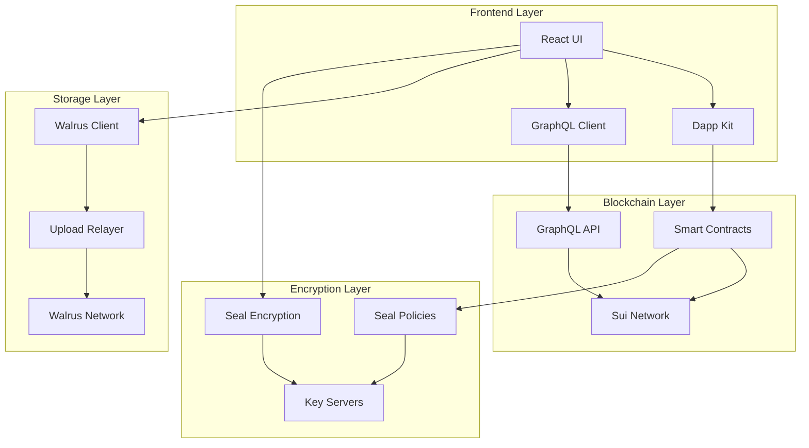

## Core Components

### 1. Smart Contract Architecture

The smart contract layer consists of interconnected Move modules that handle the core business logic:

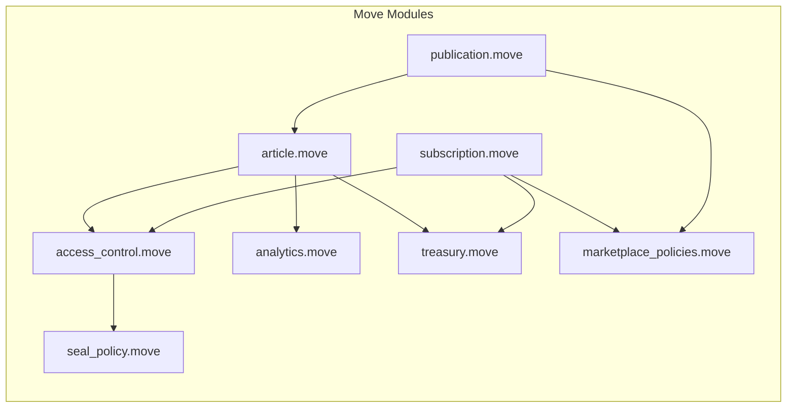

#### Module Responsibilities

**publication.move**
- Manages publication lifecycle (creation, updates, deletion)
- Stores metadata (name, description, branding)
- Issues PublisherCap for administrative functions
- Maintains publication registry

**article.move**
- Creates and manages articles within publications
- Stores encrypted content references (Walrus blob IDs)
- Links to Seal encryption IDs for access control
- Manages article tiers (FREE, BASIC, PREMIUM)

**subscription.move**
- Issues subscription NFTs to users
- Manages three subscription tiers
- Tracks subscription expiration
- Handles upgrades and renewals

**access_control.move**
- Central access verification logic
- Validates subscription permissions
- Manages read tokens for pay-per-article
- Interfaces with Seal policies

**seal_policy.move**
- Defines cryptographic access policies
- Called by Seal key servers
- Enforces on-chain access rules
- Prevents unauthorized decryption

**analytics.move**
- Tracks content engagement metrics
- Records views and full reads
- Aggregates publication statistics
- Provides publisher insights

**treasury.move**
- Manages protocol treasury and fee collection
- Collects 1% fee on subscription payments
- Requires 1% deposit for article publishing (based on premium price)
- Tracks total protocol revenue (fees + deposits)
- Admin functions for withdrawals and fee adjustments

**marketplace_policies.move**
- Manages subscription NFT trading policies
- Enforces 10% royalty on secondary sales
- Integrates with Sui Kiosk standard for marketplace
- Collects and distributes royalties to publishers
- Enables subscription transferability and liquidity

### 2. Storage Architecture (Walrus)

Walrus provides distributed, permanent storage for encrypted article content:

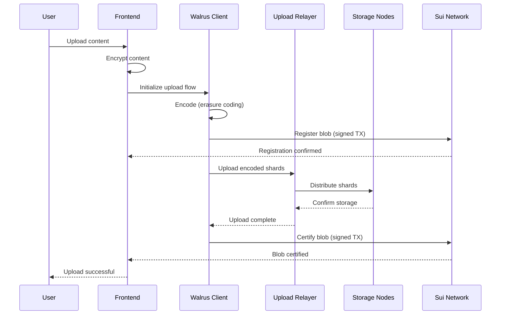

#### Storage Flow Components

**Encoding Phase**
- Applies erasure coding for redundancy
- Generates blob ID
- Prepares shards for distribution

**Registration Phase**
- Creates on-chain storage object
- Pays storage fees
- Establishes ownership

**Upload Phase**
- Transfers data to storage nodes
- Uses upload relayer for coordination
- Distributes shards across network

**Certification Phase**
- Proves successful storage
- Updates on-chain certificate
- Finalizes blob availability

### 3. Encryption Architecture (Seal)

Seal provides policy-based encryption with distributed key management:

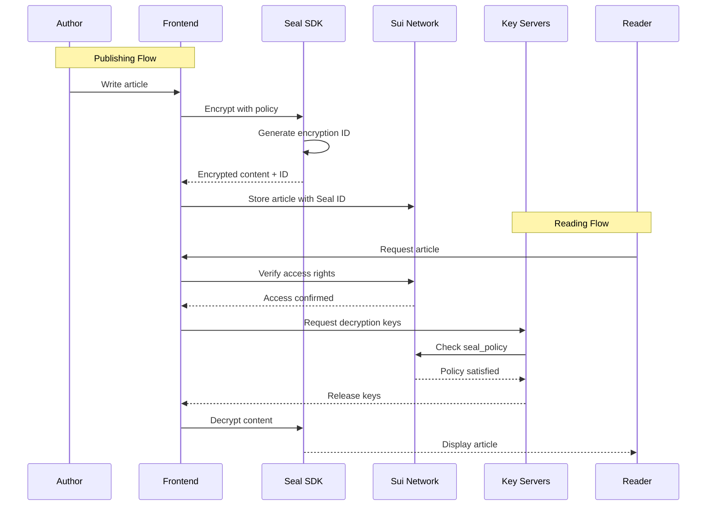

#### Encryption Components

**Policy Definition**
- Subscription-based access
- Read token validation
- Time-based expiration
- Tier-based restrictions

**Key Management**
- Distributed key servers (no single point of failure)
- Threshold cryptography
- Policy enforcement at key release
- Automatic key rotation

**Security Properties**
- End-to-end encryption
- Client-side encryption/decryption
- No plaintext on servers
- Cryptographic access enforcement

### 4. Frontend Architecture

The frontend is built with modern React and Web3 technologies:

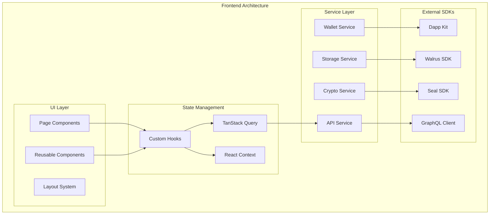

#### Frontend Components

**Page Components**
- HomePage: Landing and overview
- PublicationsPage: Browse all publications
- PublicationDetailPage: View specific publication
- ArticleReaderPage: Read encrypted articles
- WriteArticlePage: Content creation interface
- DashboardPage: Publisher analytics
- MySubscriptionsPage: Manage subscriptions

**Custom Hooks**
- usePublication: Publication CRUD operations
- useArticle: Article management
- useEncryptedArticle: Encryption/decryption
- useSubscription: Subscription management
- useAccessQueries: Permission checking
- usePublisherCaps: Admin functions

**Service Integration**
- Wallet: Transaction signing, account management
- Storage: Walrus upload/download
- Crypto: Seal encryption/decryption
- API: GraphQL queries and caching

## Data Flow Patterns

### 1. Article Publishing Flow

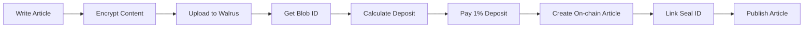

**Steps:**
1. Author writes article in editor
2. Content encrypted with Seal policy
3. Encrypted blob uploaded to Walrus
4. Blob ID retrieved from Walrus
5. **Calculate required deposit (1% of premium price)**
6. **Pay deposit to treasury (non-refundable)**
7. Article object created on Sui
8. Seal encryption ID linked to article
9. Article becomes available to readers

**Treasury Integration:**
- Deposit = `premium_price * 1% / 100`
- Example: Premium at 500 SUI → 5 SUI deposit
- Deposit prevents spam and covers infrastructure costs

### 2. Article Reading Flow

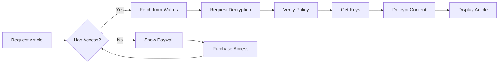

**Steps:**
1. Reader requests article
2. System checks subscription/token
3. If authorized, fetch encrypted content
4. Request decryption from Seal
5. Key servers verify policy
6. Keys released for decryption
7. Content decrypted and displayed
8. If unauthorized, show subscription options

### 3. Subscription Purchase Flow

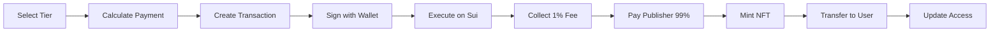

**Steps:**
1. User selects subscription tier
2. Payment amount calculated
3. Transaction created with Move call
4. User signs with wallet
5. Transaction executed on network
6. **Treasury collects 1% protocol fee**
7. **Publisher receives 99% of payment**
8. Subscription NFT minted (has `key, store` for trading)
9. NFT transferred to user
10. Access permissions updated

**Treasury Integration:**
- Fee = `payment * 1% / 100`
- Example: 500 SUI payment → 5 SUI to treasury, 495 SUI to publisher
- Subscriptions are NFTs and can be traded in Kiosk marketplace

### 4. Subscription Trading Flow (Secondary Market)

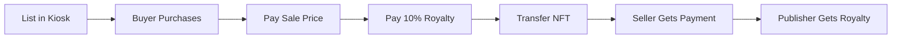

**Steps:**
1. Subscription owner lists NFT in their Kiosk at chosen price
2. Buyer initiates purchase transaction
3. Buyer pays sale price to seller
4. **Buyer pays 10% royalty to transfer policy**
5. NFT ownership transfers to buyer
6. Seller receives 90% of sale price
7. **Publisher can withdraw 10% royalty from policy**

**Marketplace Economics:**
- Default royalty: 10% of sale price
- Enables liquid secondary market for subscriptions
- Publishers earn on every resale
- Subscriptions retain access rights after transfer

## Security Architecture

### 1. Threat Model

**Protected Against:**
- Unauthorized content access
- Content tampering
- Man-in-the-middle attacks
- Replay attacks
- Privilege escalation
- Data leaks

**Trust Assumptions:**
- Sui network consensus
- Walrus storage integrity
- Seal key server honesty (threshold)
- Client device security

### 2. Security Layers

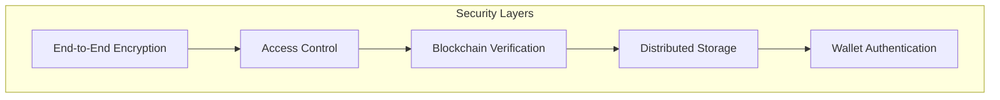

**End-to-End Encryption**
- Client-side encryption before upload
- No plaintext on servers
- Key derivation from policies

**Access Control**
- On-chain permission checks
- NFT-based subscriptions
- Cryptographic enforcement

**Blockchain Verification**
- Immutable access records
- Transparent policies
- Consensus-based validation

**Distributed Storage**
- No single point of failure
- Erasure coding redundancy
- Content integrity verification

**Wallet Authentication**
- Private key custody
- Transaction signing
- Account abstraction

### 3. Privacy Considerations

**What's Private:**
- Article content (encrypted)
- Reading history (client-side)
- Payment details (pseudonymous)

**What's Public:**
- Publication metadata
- Article metadata
- Subscription ownership
- Transaction history

## Performance Optimization

### 1. Caching Strategy

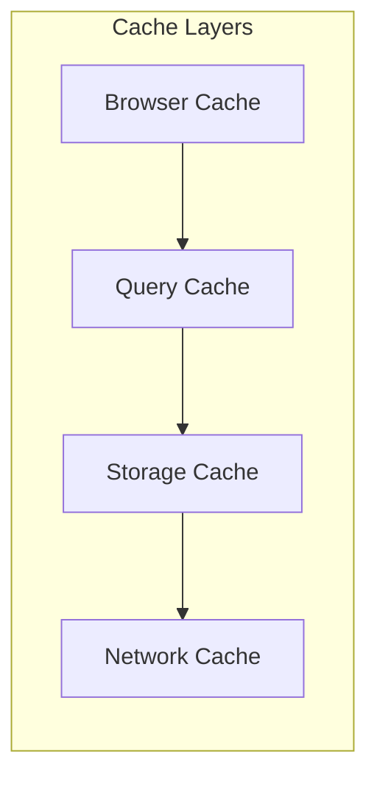

**Browser Cache**
- Static assets
- Decrypted content (session)
- User preferences

**Query Cache (TanStack)**
- GraphQL responses
- Subscription status
- Publication metadata

**Storage Cache**
- Walrus blob references
- Frequently accessed content
- Thumbnail images

**Network Cache**
- CDN for static files
- IPFS gateway caching
- API response caching

### 2. Optimization Techniques

**Lazy Loading**
- Paginated article lists
- On-demand content decryption
- Progressive image loading

**Parallel Processing**
- Concurrent Walrus uploads
- Batch GraphQL queries
- Parallel encryption operations

**Bundle Optimization**
- Code splitting by route
- Dynamic imports
- Tree shaking
- Minification

## Scalability Design

### 1. Horizontal Scaling

**Frontend**
- Stateless React app
- CDN distribution
- Load balancing

**Storage (Walrus)**
- Distributed nodes
- Automatic sharding
- Geographic distribution

**Encryption (Seal)**
- Multiple key servers
- Regional deployment
- Threshold operations

### 2. Vertical Scaling

**Smart Contracts**
- Gas optimization
- Batch operations
- Efficient data structures

**Content Delivery**
- Compression
- Streaming for large files
- Adaptive bitrate

## Monitoring and Analytics

### 1. System Metrics

**Blockchain Metrics**
- Transaction success rate
- Gas consumption
- Contract events

**Storage Metrics**
- Upload success rate
- Retrieval latency
- Storage utilization

**Application Metrics**
- Page load times
- User engagement
- Error rates

### 2. Business Analytics

**Publisher Analytics**
- Article views
- Reader engagement
- Revenue metrics
- Subscription conversions

**Platform Analytics**
- Total publications
- Active users
- Content volume
- Transaction volume

## Disaster Recovery

### 1. Data Redundancy

**Blockchain Data**
- Network consensus
- Multiple validators
- Automatic replication

**Storage Data**
- Erasure coding
- Geographic distribution
- Multiple storage nodes

**Encryption Keys**
- Threshold key sharing
- Multiple key servers
- Backup key recovery

### 2. Recovery Procedures

**Content Recovery**
- Walrus blob reconstruction
- Re-encryption if needed
- Metadata restoration

**Access Recovery**
- NFT recovery from chain
- Subscription verification
- Alternative authentication

## Future Architecture Considerations

### 1. Planned Enhancements

**Content Delivery**
- IPFS integration
- P2P content sharing
- Edge caching

**Payment Options**
- Multiple token support
- Fiat on-ramps
- Micropayments

**Advanced Features**
- Content recommendations
- Social features
- Creator tools

### 2. Scaling Roadmap

**Phase 1: Current**
- Basic functionality
- Testnet deployment
- Core features

**Phase 2: Growth**
- Performance optimization
- Additional storage providers
- Enhanced analytics

**Phase 3: Maturity**
- Multi-chain support
- Advanced monetization
- Enterprise features

## Technical Debt and Limitations

### Current Limitations

1. **Storage Costs**: Walrus storage requires upfront payment for epochs
2. **Key Server Dependency**: Relies on Seal key server availability
3. **Network Latency**: Decryption requires multiple network calls
4. **Browser Limitations**: Large file handling constraints

### Technical Debt

1. **Error Handling**: Needs comprehensive error recovery
2. **Testing Coverage**: Additional E2E tests required
3. **Documentation**: API documentation incomplete
4. **Performance**: Query optimization needed

## Conclusion

The Private Publishing Platform architecture leverages cutting-edge Web3 technologies to provide a secure, decentralized content publishing and monetization system. The modular design allows for future enhancements while maintaining security and privacy as core principles.