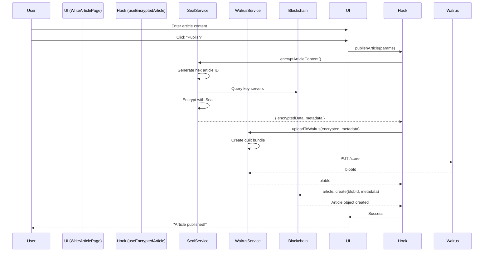
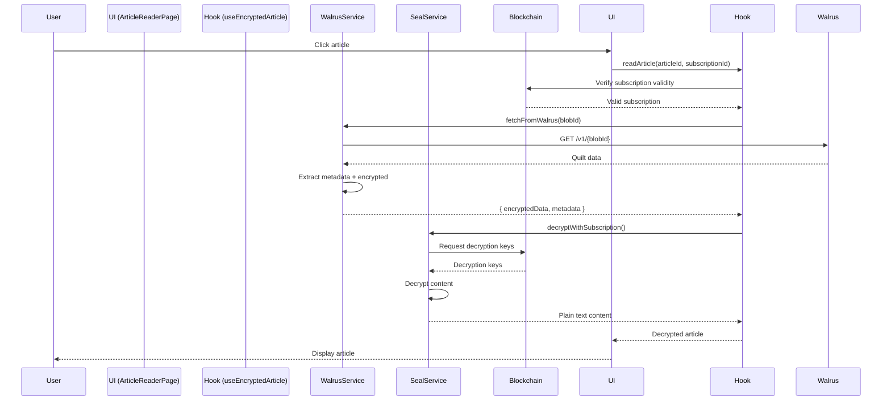
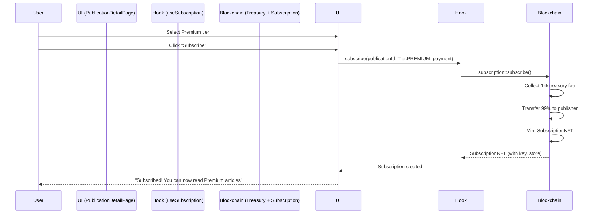

# Frontend Architecture Documentation

## Overview

The Private Publishing Platform frontend is a modern React application built with TypeScript, Vite, and the Sui blockchain ecosystem. It provides a complete decentralized publishing platform with encrypted content, NFT-based subscriptions, and Walrus storage integration.

**Tech Stack:**
- **Framework:** React 18.3.1 + TypeScript 5.9.2
- **Build Tool:** Vite 7.1.5
- **Routing:** React Router DOM 7.9.4
- **UI Library:** Radix UI Themes 3.2.1
- **State Management:** TanStack React Query 5.87.1
- **Blockchain:** @mysten/dapp-kit 0.19.6, @mysten/sui 1.43.1
- **Encryption:** @mysten/seal 0.9.1
- **Storage:** @mysten/walrus 0.8.1, @mysten/walrus-wasm 0.1.1
- **Testing:** Vitest 4.0.3, Testing Library 16.3.0

## Project Structure

```
src/
├── components/          # Reusable UI components
│   ├── Article/        # Article display components
│   ├── Layout/         # Header, Footer, Sidebar
│   ├── Navigation/     # Navigation components
│   ├── Publication/    # Publication cards and forms
│   └── Subscription/   # Subscription UI components
├── config/             # Configuration files
│   ├── constants.ts    # Module names, system objects
│   └── graphql.ts      # GraphQL endpoint config
├── hooks/              # Custom React hooks (12 hooks)
│   ├── useAccessQueries.ts
│   ├── useArticle.ts
│   ├── useEncryptedArticle.ts
│   ├── usePublication.ts
│   ├── usePublicationQueries.ts
│   ├── usePublisherCaps.ts
│   ├── useReadTokenPurchase.ts
│   ├── useSubscription.ts
│   ├── useSubscriptionPurchase.ts
│   └── useSubscriptionQueries.ts
├── pages/              # Route components (16 pages)
│   ├── HomePage.tsx
│   ├── PublicationsPage.tsx
│   ├── PublicationDetailPage.tsx
│   ├── CreatePublicationPage.tsx
│   ├── WriteArticlePage.tsx
│   ├── ArticleReaderPage.tsx
│   ├── DashboardPage.tsx
│   ├── MySubscriptionsPage.tsx
│   ├── PublicationManagementPage.tsx
│   ├── PublicationArticlesPage.tsx
│   ├── AnalyticsDashboardPage.tsx
│   ├── PublicationSettingsPage.tsx
│   ├── MarketplacePage.tsx
│   └── BackendInfoPage.tsx
├── providers/          # React Context providers
│   └── SealSessionProvider.tsx
├── services/           # External service integrations
│   ├── seal.ts         # Seal encryption/decryption
│   └── walrus.ts       # Walrus storage upload/download
├── test/               # Testing infrastructure
│   ├── fixtures/       # Test data
│   ├── mocks/          # Mock implementations
│   ├── providers/      # Test providers
│   └── utils/          # Test utilities
├── types/              # TypeScript type definitions
│   └── index.ts
├── utils/              # Helper functions
│   ├── graphqlQueries.ts
│   ├── logger.ts
│   ├── sessionStorage.ts
│   ├── sui.ts
│   └── validation.ts
├── App.tsx             # Root component with routing
├── main.tsx            # Application entry point
└── networkConfig.ts    # Network configuration
```

## Architecture Patterns

### 1. Component Organization

Components are organized by **domain** and **function**:

- **Domain-based folders** (Article/, Publication/, Subscription/) contain domain-specific UI
- **Function-based folders** (Layout/, Navigation/) contain structural components
- **Atomic design** principles (atoms → molecules → organisms)

**Example Structure:**
```
components/Publication/
├── PublicationCard.tsx          # Molecule: Display publication summary
└── CreatePublicationForm.tsx    # Organism: Complex form
```

### 2. Hook-Based Data Layer

**All data fetching and mutations** are abstracted into custom hooks:

```typescript
// Data Queries
usePublicationQueries()  // Fetch publications
useSubscriptionQueries() // Fetch subscriptions
useAccessQueries()       // Check access permissions

// Mutations
usePublication()         // Create/update publications
useSubscription()        // Subscribe/renew
useEncryptedArticle()    // Publish/read encrypted articles
```

**Benefits:**
- Centralized data logic
- Easy testing (mock hooks)
- Reusable across components
- Type-safe with TypeScript

### 3. Provider Pattern for Global State

Context providers manage cross-cutting concerns:

#### SealSessionProvider

**Purpose:** Manages Seal encryption session lifecycle

**Features:**
- Auto-loads cached sessions from localStorage
- Handles session initialization and signing
- Clears expired sessions automatically
- Provides session state to all components

**Usage:**
```typescript
const { sessionKey, isInitializing, initializeSession } = useSealSession();

// Check if ready to encrypt
const canPublish = sessionKey && !isInitializing;

// Initialize session (user signs message)
await initializeSession();
```

**Caching Strategy:**
```typescript
// Key format: seal_session_{address}_{packageId}
const cached = loadSessionKey(address, packageId);

// Auto-expire after 30 minutes
if (sessionKey.isExpired()) {
  clearSessionKey(address, packageId);
}
```

### 4. Service Layer Architecture

Services encapsulate external API interactions:

#### Seal Service (`services/seal.ts`)

**Responsibilities:**
- Encrypt article content with Seal
- Decrypt content using subscriptions or read tokens
- Manage key server interactions
- Handle Seal metadata serialization

**Key Functions:**
```typescript
// Encrypt content for publication
async function encryptArticleContent(
  content: string,
  articleId: string,  // Hex string without 0x prefix
  packageId: string,
  keyServers: string[],
  suiClient: SuiClient,
  threshold: number
): Promise<{ encryptedData: Uint8Array; metadata: SealMetadata }> {
  // Create Seal client with extension
  const sealClient = await SealClient.create({
    keyServers,
    packageId,
    threshold,
    suiClient
  });

  // Encrypt with article ID as resource
  const encrypted = await sealClient.encrypt(
    new TextEncoder().encode(content),
    articleId
  );

  return {
    encryptedData: encrypted.ciphertext,
    metadata: {
      keyIds: Array.from(encrypted.keyIds),
      // ... other metadata
    }
  };
}

// Decrypt with subscription NFT
async function decryptWithSubscription(
  encryptedData: Uint8Array,
  metadata: SealMetadata,
  subscriptionId: string,
  sessionKey: SessionKey,
  suiClient: SuiClient
): Promise<string> {
  const sealClient = await SealClient.asClientExtension({
    sessionKey,
    suiClient
  });

  const decrypted = await sealClient.decrypt(
    encryptedData,
    metadata.keyIds.map(id => fromHex(id)),
    subscriptionId  // Subscription NFT grants access
  );

  return new TextDecoder().decode(decrypted);
}
```

#### Walrus Service (`services/walrus.ts`)

**Responsibilities:**
- Upload encrypted articles to Walrus
- Download and extract article content
- Handle quilt format (bundled encryption metadata)
- Manage upload relay for browser compatibility

**Key Functions:**
```typescript
// Upload encrypted article with metadata
async function uploadToWalrus(
  encryptedData: Uint8Array,
  metadata: SealMetadata
): Promise<string> {
  // Create quilt: metadata + encrypted content
  const quilt = createQuilt(metadata, encryptedData);

  // Upload via relay
  const response = await fetch(WALRUS_UPLOAD_URL, {
    method: 'PUT',
    body: quilt
  });

  const result = await response.json();
  return result.newlyCreated.blobObject.blobId;
}

// Download and extract article
async function fetchFromWalrus(
  blobId: string
): Promise<{ content: Uint8Array; metadata: SealMetadata }> {
  // Fetch quilt from Walrus
  const response = await fetch(`${WALRUS_AGGREGATOR_URL}/${blobId}`);
  const quiltData = await response.arrayBuffer();

  // Extract metadata and encrypted content
  return extractFromQuilt(new Uint8Array(quiltData));
}
```

**Quilt Format:**
```
[File Identifier][Metadata Length][Metadata JSON][Encrypted Content]
  ↑                ↑                  ↑                ↑
  20 bytes         4 bytes (u32)      N bytes          M bytes
  "encrypted-article.bin"
```

### 5. Type System

**Central type definitions** in `types/index.ts`:

```typescript
// Subscription tiers match Move enum
export enum Tier {
  FREE = 0,
  BASIC = 1,
  PREMIUM = 2
}

// On-chain object representations
export interface Publication {
  id: string;
  creator: string;
  name: string;
  description: string;
  free_tier_enabled: boolean;
  basic_price: string;
  premium_price: string;
  created_at: string;
}

export interface Article {
  id: string;
  publication_id: string;
  title: string;
  excerpt: string;
  tier: Tier;
  walrus_blob_id: string;
  seal_key_id: number[];  // Seal key server object IDs
  created_at: string;
}

export interface SubscriptionNFT {
  id: string;
  publication_id: string;
  tier: Tier;
  subscribed_at: string;
  expires_at: string;
  subscriber: string;
}
```

## Data Flow Patterns

### Publishing Flow



### Reading Flow



### Subscription Flow



## Custom Hooks Reference

### Data Query Hooks

#### `usePublicationQueries()`

Fetches publications from blockchain.

```typescript
const {
  publications,        // Publication[]
  isLoading,          // boolean
  error,              // Error | null
  refetch             // () => void
} = usePublicationQueries();
```

**Implementation:**
- Uses `useSuiClientQuery` from @mysten/dapp-kit
- Queries `getOwnedObjects` with `StructType` filter
- Parses Move objects into TypeScript types

#### `useSubscriptionQueries(address?: string)`

Fetches subscriptions for an address.

```typescript
const {
  subscriptions,      // SubscriptionNFT[]
  isLoading,
  error,
  refetch
} = useSubscriptionQueries(account?.address);
```

**Features:**
- Filters by owner address
- Checks expiry status
- Maps Move enum to TypeScript enum

#### `useAccessQueries(articleId: string, subscriptionId?: string)`

Checks if user has access to an article.

```typescript
const {
  hasAccess,          // boolean
  requiredTier,       // Tier
  subscriptionTier,   // Tier | null
  isExpired,          // boolean
  isLoading
} = useAccessQueries(articleId, subscriptionId);
```

**Logic:**
1. Fetch article (get required tier)
2. Fetch subscription (get user tier)
3. Check expiry
4. Compare tiers (FREE < BASIC < PREMIUM)

### Mutation Hooks

#### `usePublishEncryptedArticle()`

Publishes an encrypted article.

```typescript
const {
  publishArticle,     // (params: PublishArticleParams) => Promise<void>
  isPublishing,       // boolean
  error               // Error | null
} = usePublishEncryptedArticle();

await publishArticle({
  publicationId,
  publisherCapId,
  statsId,
  title,
  excerpt,
  content,           // Plain text
  tier: Tier.PREMIUM
});
```

**Flow:**
1. Generate hex article ID for Seal
2. Encrypt content with `encryptArticleContent()`
3. Upload encrypted data to Walrus
4. Calculate treasury deposit (1% of premium price)
5. Execute on-chain `article::create()` transaction
6. Emit success/error

**Error Handling:**
- Session not initialized: Prompts user to initialize
- Encryption fails: Shows Seal error details
- Upload fails: Walrus connectivity issues
- Transaction fails: Shows blockchain error

#### `useSubscription()`

Creates or renews subscriptions.

```typescript
const {
  subscribe,          // (params) => Promise<void>
  renew,              // (subscriptionId, publicationId) => Promise<void>
  isLoading,
  error
} = useSubscription();

// New subscription
await subscribe({
  publicationId,
  tier: Tier.PREMIUM,
  paymentAmount: 500_000_000_000  // 500 SUI in MIST
});

// Renew subscription
await renew(subscriptionId, publicationId);
```

**Implementation Details:**
- Splits payment coin from gas
- Calls `subscription::subscribe()` (treasury fee deducted automatically)
- Receives SubscriptionNFT (transferred to user)
- Records analytics (subscriber count, revenue)

#### `usePublication()`

Creates publications.

```typescript
const {
  createPublication,  // (params: CreatePublicationParams) => Promise<string>
  isCreating,
  error
} = usePublication();

const publicationId = await createPublication({
  name: "Crypto Insights",
  description: "Deep dives into blockchain tech",
  freeTierEnabled: true,
  basicPrice: 100_000_000_000,    // 100 SUI
  premiumPrice: 500_000_000_000   // 500 SUI
});
```

**Flow:**
1. Create `Publication` on-chain
2. Mint `PublisherCap` (proves ownership)
3. Create `PublicationStats` object
4. Transfer PublisherCap to creator

### Specialized Hooks

#### `usePublisherCaps(address?: string)`

Fetches publications owned by user (via PublisherCap).

```typescript
const {
  publisherCaps,      // { capId: string; publicationId: string }[]
  publications,       // Publication[]
  isLoading,
  error
} = usePublisherCaps(account?.address);
```

**Usage:** Powers publisher dashboard to show owned publications.

#### `useReadTokenPurchase()`

Handles pay-per-article purchases (future feature).

```typescript
const {
  purchaseReadToken,  // (articleId, paymentAmount) => Promise<string>
  isLoading,
  error
} = useReadTokenPurchase();
```

**Flow:**
1. User pays for single article access
2. Receives ReadToken NFT (1-time use)
3. Can decrypt that specific article

## State Management

### React Query for Server State

**All blockchain data** is managed by TanStack React Query:

**Benefits:**
- Automatic caching
- Background refetching
- Optimistic updates
- Loading/error states

**Configuration:**
```typescript
// main.tsx
import { QueryClient, QueryClientProvider } from '@tanstack/react-query';

const queryClient = new QueryClient({
  defaultOptions: {
    queries: {
      staleTime: 60_000,     // Consider data fresh for 1 minute
      cacheTime: 300_000,    // Keep in cache for 5 minutes
      refetchOnWindowFocus: true,
      retry: 3
    }
  }
});
```

**Hook Pattern:**
```typescript
export function usePublications() {
  return useQuery({
    queryKey: ['publications'],
    queryFn: async () => {
      const objects = await client.getOwnedObjects({
        filter: {
          StructType: `${packageId}::publication::Publication`
        }
      });
      return objects.data.map(parsePublication);
    }
  });
}
```

### Context for UI State

**SealSessionProvider** manages session state globally:

```typescript
// Wrap app
<SealSessionProvider>
  <App />
</SealSessionProvider>

// Access anywhere
const { sessionKey } = useSealSession();
```

**Local Component State:**
- Form inputs: `useState`
- UI toggles: `useState`
- Temporary data: `useState`

## Testing Infrastructure

### Test Setup

**Test Framework:** Vitest (Jest-compatible)
**Test Library:** React Testing Library
**Coverage Tool:** @vitest/coverage-v8

**Configuration (`vitest.config.ts`):**
```typescript
export default defineConfig({
  test: {
    globals: true,
    environment: 'jsdom',
    setupFiles: './src/test/setup.ts',
    coverage: {
      provider: 'v8',
      reporter: ['text', 'json', 'html'],
      exclude: ['node_modules/', 'src/test/']
    }
  }
});
```

### Mock Infrastructure

**Location:** `src/test/mocks/`

#### Mock dapp-kit (`mocks/dapp-kit.ts`)

Mocks Sui wallet and client hooks:

```typescript
export const mockUseSuiClient = vi.fn(() => ({
  getObject: vi.fn(),
  multiGetObjects: vi.fn(),
  executeTransactionBlock: vi.fn()
}));

export const mockUseCurrentAccount = vi.fn(() => ({
  address: '0xTEST_ADDRESS'
}));

export const mockUseSignAndExecuteTransaction = vi.fn(() => ({
  mutateAsync: vi.fn()
}));
```

#### Mock Walrus (`mocks/walrus.ts`)

Mocks Walrus upload/download:

```typescript
export const mockUploadToWalrus = vi.fn(async (data: Uint8Array) => {
  return 'MOCK_BLOB_ID_123';
});

export const mockFetchFromWalrus = vi.fn(async (blobId: string) => {
  return {
    content: new Uint8Array([1, 2, 3]),
    metadata: { keyIds: ['0xKEY1', '0xKEY2'] }
  };
});
```

#### Mock Seal (`mocks/seal.ts`)

Mocks encryption/decryption:

```typescript
export const mockEncryptArticleContent = vi.fn(async (content: string) => {
  return {
    encryptedData: new TextEncoder().encode(content),
    metadata: { keyIds: [1, 2] }
  };
});

export const mockDecryptWithSubscription = vi.fn(async () => {
  return 'Decrypted article content';
});
```

### Test Providers

**TestWrapper** (`test/providers/TestWrapper.tsx`):

Wraps components with necessary providers for testing:

```typescript
export function TestWrapper({ children }: { children: ReactNode }) {
  const queryClient = new QueryClient({
    defaultOptions: {
      queries: { retry: false },
      mutations: { retry: false }
    }
  });

  return (
    <QueryClientProvider client={queryClient}>
      <SuiClientProvider networks={networkConfig} defaultNetwork="testnet">
        <WalletProvider>
          <SealSessionProvider>
            {children}
          </SealSessionProvider>
        </WalletProvider>
      </SuiClientProvider>
    </QueryClientProvider>
  );
}
```

**Usage:**
```typescript
import { render } from '../test/utils/render';

test('displays publication', () => {
  const { getByText } = render(
    <PublicationCard publication={mockPublication} />,
    { wrapper: TestWrapper }
  );

  expect(getByText('Crypto Insights')).toBeInTheDocument();
});
```

### Test Fixtures

**Location:** `src/test/fixtures/`

Pre-defined test data:

```typescript
export const mockPublication: Publication = {
  id: '0xPUB123',
  creator: '0xCREATOR',
  name: 'Test Publication',
  description: 'A test publication',
  free_tier_enabled: true,
  basic_price: '100000000000',
  premium_price: '500000000000',
  created_at: '1700000000'
};

export const mockArticle: Article = {
  id: '0xART456',
  publication_id: '0xPUB123',
  title: 'Test Article',
  excerpt: 'Article excerpt',
  tier: Tier.PREMIUM,
  walrus_blob_id: 'BLOB789',
  seal_key_id: [1, 2],
  created_at: '1700000000'
};
```

## Configuration

### Network Configuration

**File:** `src/networkConfig.ts`

```typescript
const { networkConfig, useNetworkVariable } = createNetworkConfig({
  testnet: {
    url: getFullnodeUrl("testnet"),
    variables: {
      packageId: "0x41f5e97994f1f15479821e68e8018b2c52b32a07aea2df59a9db1141690fd88f",
      treasuryId: "0xc97daeff8a72b4f0bed8f66c3c19779d78d6eedbfe3e58774a1495701f863a22",
      sealKeyServers: [
        "0x73d05d62c18d9374e3ea529e8e0ed6161da1a141a94d3f76ae3fe4e99356db75",
        "0xf5d14a81a982144ae441cd7d64b09027f116a468bd36e7eca494f750591623c8"
      ]
    }
  }
});
```

**Usage in components:**
```typescript
const packageId = useNetworkVariable('packageId');
const treasuryId = useNetworkVariable('treasuryId');
const sealKeyServers = useNetworkVariable('sealKeyServers');
```

### Constants

**File:** `src/config/constants.ts`

```typescript
export const MODULES = {
  PUBLICATION: 'publication',
  ARTICLE: 'article',
  SUBSCRIPTION: 'subscription',
  ACCESS_CONTROL: 'access_control',
  ANALYTICS: 'analytics',
  TREASURY: 'treasury',
  MARKETPLACE_POLICIES: 'marketplace_policies'
} as const;

export const SYSTEM_OBJECTS = {
  CLOCK: '0x6',
  RANDOM: '0x8'
} as const;
```

## Routing Architecture

### Route Structure

**File:** `src/App.tsx`

```typescript
<Routes>
  {/* Public routes */}
  <Route path="/" element={<HomePage />} />
  <Route path="/publications" element={<PublicationsPage />} />
  <Route path="/publications/:id" element={<PublicationDetailPage />} />
  <Route path="/articles/:articleId" element={<ArticleReaderPage />} />

  {/* Publisher routes */}
  <Route path="/create-publication" element={<CreatePublicationPage />} />
  <Route path="/dashboard" element={<DashboardPage />} />
  <Route path="/dashboard/write" element={<WriteArticlePage />} />
  <Route path="/dashboard/publications/:id" element={<PublicationManagementPage />} />
  <Route path="/dashboard/publications/:id/articles" element={<PublicationArticlesPage />} />
  <Route path="/dashboard/publications/:id/analytics" element={<AnalyticsDashboardPage />} />
  <Route path="/dashboard/publications/:id/settings" element={<PublicationSettingsPage />} />

  {/* Reader routes */}
  <Route path="/my-subscriptions" element={<MySubscriptionsPage />} />
  <Route path="/marketplace" element={<MarketplacePage />} />

  {/* System routes */}
  <Route path="/backend-info" element={<BackendInfoPage />} />
</Routes>
```

### Navigation Guards

**Pattern:** Check wallet connection in components:

```typescript
export function WriteArticlePage() {
  const account = useCurrentAccount();

  if (!account) {
    return (
      <Box p="4">
        <Text>Please connect your wallet to publish articles.</Text>
        <ConnectButton />
      </Box>
    );
  }

  return <WriteArticleForm />;
}
```

### URL Parameters

**Reading params:**
```typescript
import { useParams } from 'react-router-dom';

export function PublicationDetailPage() {
  const { id } = useParams<{ id: string }>();

  const { publication, isLoading } = usePublication(id);
  // ...
}
```

**Programmatic navigation:**
```typescript
import { useNavigate } from 'react-router-dom';

const navigate = useNavigate();

// After publishing article
await publishArticle(params);
navigate(`/publications/${publicationId}/articles/${articleId}`);
```

## Performance Optimizations

### 1. Code Splitting

**Lazy load routes:**
```typescript
const AnalyticsDashboardPage = lazy(() =>
  import('./pages/AnalyticsDashboardPage')
);

<Route
  path="/dashboard/publications/:id/analytics"
  element={
    <Suspense fallback={<LoadingSpinner />}>
      <AnalyticsDashboardPage />
    </Suspense>
  }
/>
```

### 2. React Query Caching

**Aggressive caching** for expensive queries:

```typescript
useQuery({
  queryKey: ['publications'],
  queryFn: fetchPublications,
  staleTime: 5 * 60 * 1000,  // 5 minutes
  cacheTime: 30 * 60 * 1000  // 30 minutes
});
```

### 3. Memoization

**Expensive computations:**
```typescript
const filteredArticles = useMemo(() => {
  return articles.filter(article => article.tier === selectedTier);
}, [articles, selectedTier]);
```

### 4. Optimistic Updates

**Immediate UI feedback:**
```typescript
const { mutate: subscribe } = useMutation({
  mutationFn: subscribeToPublication,
  onMutate: async (newSub) => {
    // Cancel outgoing queries
    await queryClient.cancelQueries(['subscriptions']);

    // Snapshot previous value
    const previous = queryClient.getQueryData(['subscriptions']);

    // Optimistically update
    queryClient.setQueryData(['subscriptions'], (old) => [...old, newSub]);

    return { previous };
  },
  onError: (err, newSub, context) => {
    // Rollback on error
    queryClient.setQueryData(['subscriptions'], context.previous);
  },
  onSettled: () => {
    // Refetch to ensure sync
    queryClient.invalidateQueries(['subscriptions']);
  }
});
```

## Error Handling

### Global Error Boundary

```typescript
class ErrorBoundary extends React.Component {
  state = { hasError: false, error: null };

  static getDerivedStateFromError(error) {
    return { hasError: true, error };
  }

  componentDidCatch(error, errorInfo) {
    logger.error({ error, errorInfo }, 'React error boundary caught error');
  }

  render() {
    if (this.state.hasError) {
      return <ErrorFallback error={this.state.error} />;
    }

    return this.props.children;
  }
}
```

### Hook-Level Error Handling

```typescript
export function usePublishEncryptedArticle() {
  const [error, setError] = useState<Error | null>(null);

  const publishArticle = async (params: PublishArticleParams) => {
    setError(null);

    try {
      // ... publish logic
    } catch (err) {
      const error = err instanceof Error ? err : new Error('Unknown error');
      setError(error);
      logger.error({ error, params }, 'Failed to publish article');
      throw error; // Re-throw for component handling
    }
  };

  return { publishArticle, error };
}
```

### User-Facing Error Messages

```typescript
if (error) {
  if (error.message.includes('Seal session')) {
    return <Alert>Please initialize your Seal session first.</Alert>;
  } else if (error.message.includes('Insufficient')) {
    return <Alert>Insufficient funds for this transaction.</Alert>;
  } else {
    return <Alert>An error occurred: {error.message}</Alert>;
  }
}
```

## Logging

**Library:** Pino (structured logging)

**File:** `src/utils/logger.ts`

```typescript
import pino from 'pino';

export const logger = pino({
  level: import.meta.env.DEV ? 'debug' : 'info',
  browser: {
    asObject: true
  }
});

// Usage
logger.info({ context: 'ui', operation: 'subscribe' }, 'User subscribed');
logger.error({ context: 'seal', error }, 'Encryption failed');
logger.debug({ params }, 'Publishing article with params');
```

**Structured Log Format:**
```json
{
  "level": "info",
  "time": 1700000000000,
  "context": "ui",
  "operation": "subscribe",
  "publicationId": "0xPUB123",
  "msg": "User subscribed"
}
```

## Security Considerations

### 1. Session Storage

**SessionKey** is stored in localStorage with proper scoping:

```typescript
// Key format: seal_session_{address}_{packageId}
const storageKey = `seal_session_${address}_${packageId}`;

// Expired sessions are cleared automatically
if (sessionKey.isExpired()) {
  clearSessionKey(address, packageId);
}
```

**Security notes:**
- SessionKeys expire after 30 minutes
- Cleared on wallet disconnect
- Scoped per address and package ID

### 2. Input Validation

**All user inputs validated:**
```typescript
// Title length
if (title.length < 5 || title.length > 200) {
  throw new Error('Title must be 5-200 characters');
}

// Price validation
if (premiumPrice < basicPrice) {
  throw new Error('Premium price must be higher than basic');
}

// Address validation
if (!isValidSuiAddress(address)) {
  throw new Error('Invalid Sui address');
}
```

### 3. XSS Protection

**Markdown rendering:**
```typescript
import ReactMarkdown from 'react-markdown';
import remarkGfm from 'remark-gfm';

<ReactMarkdown
  remarkPlugins={[remarkGfm]}
  components={{
    // Disallow dangerous HTML
    html: () => null
  }}
>
  {articleContent}
</ReactMarkdown>
```

## Development Workflow

### Local Development

```bash
# Install dependencies
npm install

# Start dev server (with HMR)
npm run dev

# Run tests in watch mode
npm run test:watch

# Run tests with coverage
npm run test:coverage

# Type checking
npm run build  # Runs tsc before vite build
```

### Code Quality

**Linting:**
```bash
npm run lint
```

**Formatting (Prettier):**
```bash
npm run format
```

### Debugging

**Vite DevTools:**
- React DevTools extension
- Redux DevTools (for inspecting React Query cache)
- Browser Network tab (inspect blockchain calls)

**Logging:**
```typescript
// Enable debug logs
localStorage.setItem('debug', '*');

// Disable debug logs
localStorage.removeItem('debug');
```

## Best Practices

### 1. Component Design

**Single Responsibility:**
```typescript
// ❌ Bad: Mixed concerns
function PublicationCardWithSubscribe({ publication }) {
  // Displays publication AND handles subscription logic
}

// ✅ Good: Separate concerns
function PublicationCard({ publication, onSubscribe }) {
  // Only displays publication
}

function SubscribeButton({ publicationId }) {
  // Only handles subscription logic
}
```

### 2. Hook Composition

**Combine hooks for complex logic:**
```typescript
function useArticleReader(articleId: string) {
  const account = useCurrentAccount();
  const { subscriptions } = useSubscriptionQueries(account?.address);
  const { readArticle } = useEncryptedArticle();
  const { sessionKey } = useSealSession();

  const canRead = subscriptions.some(sub =>
    sub.publication_id === article.publication_id && !sub.isExpired
  );

  return { canRead, readArticle, sessionKey };
}
```

### 3. Type Safety

**Strict TypeScript:**
```typescript
// ✅ Use specific types, not 'any'
interface PublishParams {
  publicationId: string;
  title: string;
  content: string;
}

function publishArticle(params: PublishParams): Promise<string> {
  // ...
}

// ❌ Avoid 'any'
function publishArticle(params: any): any {
  // ...
}
```

### 4. Error Boundaries

**Wrap risky components:**
```typescript
<ErrorBoundary fallback={<ErrorPage />}>
  <ArticleReaderPage />
</ErrorBoundary>
```

## Common Patterns

### 1. Loading States

```typescript
function PublicationsPage() {
  const { publications, isLoading, error } = usePublicationQueries();

  if (isLoading) return <LoadingSpinner />;
  if (error) return <ErrorMessage error={error} />;
  if (!publications.length) return <EmptyState />;

  return <PublicationList publications={publications} />;
}
```

### 2. Conditional Rendering

```typescript
{sessionKey ? (
  <Button onClick={publishArticle}>Publish</Button>
) : (
  <Button onClick={initializeSession}>Initialize Session First</Button>
)}
```

### 3. Form Handling

```typescript
function CreatePublicationForm() {
  const [formData, setFormData] = useState(initialState);
  const { createPublication, isCreating } = usePublication();

  const handleSubmit = async (e: FormEvent) => {
    e.preventDefault();

    try {
      const id = await createPublication(formData);
      navigate(`/publications/${id}`);
    } catch (error) {
      showError(error);
    }
  };

  return <form onSubmit={handleSubmit}>...</form>;
}
```

## Troubleshooting

### Common Issues

**1. Seal Session Not Initialized**

**Symptom:** "Seal session not initialized" error when publishing

**Solution:**
```typescript
// Ensure session is initialized before publishing
if (!sessionKey) {
  await initializeSession();
}
```

**2. Walrus Upload Fails**

**Symptom:** 502 Bad Gateway from Walrus

**Solution:**
- Check Walrus aggregator URL in config
- Verify upload relay is accessible
- Check network connectivity

**3. React Query Cache Stale**

**Symptom:** UI shows old data after mutation

**Solution:**
```typescript
// Invalidate queries after mutation
await createPublication(params);
queryClient.invalidateQueries(['publications']);
```

**4. Type Mismatch (Tier Enum)**

**Symptom:** Tier value doesn't match blockchain

**Solution:**
```typescript
// Use enum values, not strings
subscribe({ tier: Tier.PREMIUM });  // ✅
subscribe({ tier: 'PREMIUM' });     // ❌
```

## Future Enhancements

### Planned Features

1. **Real-time Updates** - WebSocket subscriptions for live article notifications
2. **Offline Support** - Service worker for caching articles
3. **Subscription Marketplace** - UI for trading subscription NFTs
4. **Advanced Analytics** - Charts and graphs for publishers
5. **Search Functionality** - Full-text search across articles
6. **Draft System** - Save article drafts before publishing
7. **Rich Text Editor** - WYSIWYG editor for article writing
8. **Image Uploads** - Integrated image storage via Walrus
9. **Comments Section** - Reader comments on articles
10. **Social Sharing** - Share articles to social media

## Resources

### Documentation
- [Sui Documentation](https://docs.sui.io)
- [@mysten/dapp-kit Docs](https://sdk.mystenlabs.com/dapp-kit)
- [Seal Documentation](https://docs.seal.sui.io)
- [Walrus Documentation](https://docs.walrus.site)
- [React Query Docs](https://tanstack.com/query/latest)
- [Radix UI Docs](https://www.radix-ui.com/themes/docs)

### Tools
- [Sui Explorer](https://suiexplorer.com)
- [Walrus Explorer](https://walrus.site)
- [Vite Docs](https://vite.dev)
- [Vitest Docs](https://vitest.dev)

## See Also

- [Treasury Documentation](./TREASURY.md) - Platform fees and economics
- [Kiosk Integration](./KIOSK_INTEGRATION.md) - NFT marketplace features
- [Walrus Integration](./WALRUS_INTEGRATION.md) - Storage architecture
- [API Reference](./API_AND_CONTRACTS.md) - Complete API documentation
- [User Guide](./USER_GUIDE.md) - End-user documentation
