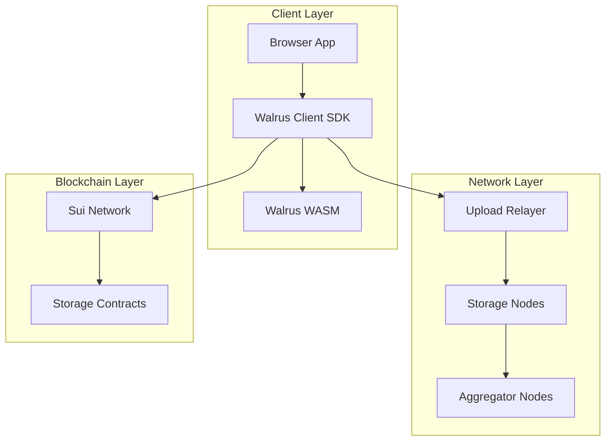
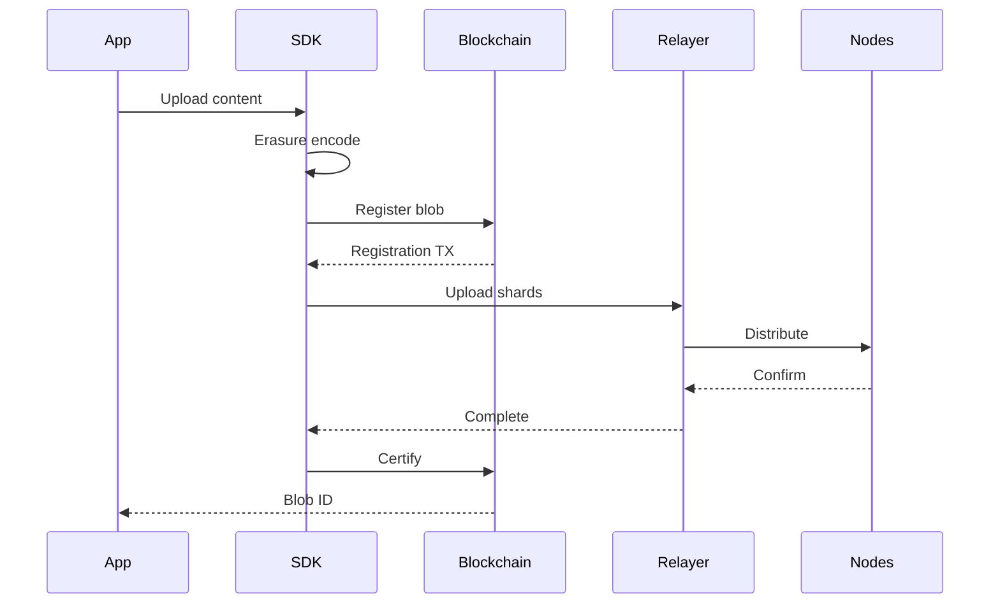

# Walrus Storage Integration Documentation

## Table of Contents

1. [Overview](#overview)
2. [Architecture](#architecture)
3. [Browser Integration](#browser-integration)
4. [Implementation Details](#implementation-details)
5. [API Reference](#api-reference)
6. [Best Practices](#best-practices)
7. [Error Handling](#error-handling)
8. [Performance Optimization](#performance-optimization)
9. [Testing](#testing)
10. [Troubleshooting](#troubleshooting)

---

## Overview

Walrus is a decentralized storage network that provides reliable, permanent data storage for the Private Publishing Platform. It uses erasure coding and distributed storage nodes to ensure data availability and durability.

### Key Features

- **Decentralized Storage**: Data distributed across multiple nodes
- **Erasure Coding**: Redundancy without full replication
- **Permanent Storage**: Pay once, store for epochs
- **Content Addressing**: Immutable blob IDs
- **Browser Compatible**: Direct browser uploads/downloads

### Integration Benefits

- **Cost Effective**: Lower storage costs than on-chain
- **Scalability**: Handle large content files
- **Availability**: High availability through redundancy
- **Privacy**: Encrypted content storage
- **Performance**: Parallel shard distribution

---

## Architecture

### System Components



### Storage Flow



---

## Browser Integration

### Installation

```bash
# Install Walrus SDK and WASM
pnpm add @mysten/walrus @mysten/walrus-wasm
```

### Configuration

#### Vite Configuration

```typescript
// vite.config.ts
import { defineConfig } from 'vite';
import react from '@vitejs/plugin-react';

export default defineConfig({
  plugins: [react()],
  optimizeDeps: {
    exclude: ['@mysten/walrus-wasm'],
  },
  server: {
    fs: {
      allow: ['..'],
    },
  },
});
```

#### TypeScript Configuration

```typescript
// walrus.d.ts
declare module '@mysten/walrus-wasm/web/walrus_wasm_bg.wasm?url' {
  const url: string;
  export default url;
}
```

### Client Initialization

```typescript
import { WalrusClient } from '@mysten/walrus';
import { SuiClient } from '@mysten/sui/client';
import walrusWasmUrl from '@mysten/walrus-wasm/web/walrus_wasm_bg.wasm?url';

export function createWalrusClient(
  suiClient: SuiClient,
  network: 'testnet' | 'mainnet' = 'testnet'
): WalrusClient {
  return new WalrusClient({
    network,
    suiClient,
    wasmUrl: walrusWasmUrl,
  });
}
```

---

## Implementation Details

### Upload Implementation

#### Basic Upload Function

```typescript
import { WalrusClient, WalrusFile } from '@mysten/walrus';
import { Transaction } from '@mysten/sui/transactions';

export async function uploadToWalrus(
  content: Uint8Array,
  suiClient: SuiClient,
  ownerAddress: string,
  signAndExecute: (params: { transaction: Transaction }) => Promise<any>,
  epochs: number = 5
): Promise<WalrusUploadResult> {
  // Initialize client
  const walrus = createWalrusClient(suiClient);

  // Create file wrapper
  const file = WalrusFile.from({
    contents: content,
    identifier: `upload-${Date.now()}.bin`,
  });

  // Initialize upload flow
  const flow = walrus.writeFilesFlow({ files: [file] });

  try {
    // Step 1: Encode
    console.log('Encoding file...');
    await flow.encode();

    // Step 2: Register on-chain
    console.log('Registering on blockchain...');
    const registerTx = flow.register({
      epochs,
      owner: ownerAddress,
      deletable: true,
    });

    const registerResult = await signAndExecute({
      transaction: registerTx
    });
    console.log('Registration TX:', registerResult.digest);

    // Step 3: Upload to storage nodes
    console.log('Uploading to storage nodes...');
    await flow.upload();

    // Step 4: Certify on-chain
    console.log('Certifying upload...');
    const certifyTx = flow.certify();

    const certifyResult = await signAndExecute({
      transaction: certifyTx
    });
    console.log('Certification TX:', certifyResult.digest);

    // Get results
    const files = flow.listFiles();
    if (files.length === 0) {
      throw new Error('No files uploaded');
    }

    return {
      blobId: files[0].blobId,
      size: content.length,
      epochs,
      owner: ownerAddress,
    };
  } catch (error) {
    console.error('Walrus upload failed:', error);
    throw error;
  }
}
```

#### Advanced Upload with Progress

```typescript
export async function uploadWithProgress(
  file: File,
  onProgress: (progress: UploadProgress) => void
): Promise<WalrusUploadResult> {
  const stages = [
    { name: 'encoding', weight: 0.1 },
    { name: 'registering', weight: 0.2 },
    { name: 'uploading', weight: 0.6 },
    { name: 'certifying', weight: 0.1 },
  ];

  let currentStage = 0;
  let stageProgress = 0;

  const updateProgress = (stage: number, progress: number) => {
    currentStage = stage;
    stageProgress = progress;

    const totalProgress = stages
      .slice(0, stage)
      .reduce((sum, s) => sum + s.weight, 0) +
      (stages[stage].weight * progress);

    onProgress({
      stage: stages[stage].name,
      stageProgress: progress * 100,
      totalProgress: totalProgress * 100,
      message: `${stages[stage].name}: ${Math.round(progress * 100)}%`,
    });
  };

  // Read file
  const buffer = await file.arrayBuffer();
  const content = new Uint8Array(buffer);

  // Initialize client
  const walrus = createWalrusClient(suiClient);

  // Create file
  const walrusFile = WalrusFile.from({
    contents: content,
    identifier: file.name,
  });

  const flow = walrus.writeFilesFlow({ files: [walrusFile] });

  // Encode with progress
  updateProgress(0, 0);
  await flow.encode();
  updateProgress(0, 1);

  // Register
  updateProgress(1, 0);
  const registerTx = flow.register({
    epochs: 5,
    owner: account.address,
    deletable: true,
  });
  await signAndExecute({ transaction: registerTx });
  updateProgress(1, 1);

  // Upload with progress simulation
  updateProgress(2, 0);
  const uploadPromise = flow.upload();

  // Simulate progress (actual progress would come from SDK)
  const progressInterval = setInterval(() => {
    stageProgress = Math.min(stageProgress + 0.1, 0.9);
    updateProgress(2, stageProgress);
  }, 500);

  await uploadPromise;
  clearInterval(progressInterval);
  updateProgress(2, 1);

  // Certify
  updateProgress(3, 0);
  const certifyTx = flow.certify();
  await signAndExecute({ transaction: certifyTx });
  updateProgress(3, 1);

  const files = flow.listFiles();
  return {
    blobId: files[0].blobId,
    size: content.length,
  };
}
```

### Download Implementation

#### Basic Download

```typescript
export async function downloadFromWalrus(
  blobId: string,
  walrusClient?: WalrusClient
): Promise<Uint8Array> {
  const client = walrusClient || createWalrusClient(suiClient);

  try {
    console.log(`Downloading blob: ${blobId}`);

    // Read blob from Walrus
    const blob = await client.readBlob({ blobId });

    if (!blob) {
      throw new Error(`Blob ${blobId} not found`);
    }

    return blob;
  } catch (error) {
    console.error('Walrus download failed:', error);
    throw error;
  }
}
```

#### Streaming Download

```typescript
export async function streamFromWalrus(
  blobId: string,
  onChunk: (chunk: Uint8Array, progress: number) => void
): Promise<void> {
  const client = createWalrusClient(suiClient);

  // Get blob metadata
  const metadata = await client.getBlobMetadata({ blobId });
  const totalSize = metadata.size;
  let receivedSize = 0;

  // Stream blob
  const stream = await client.streamBlob({ blobId });
  const reader = stream.getReader();

  try {
    while (true) {
      const { done, value } = await reader.read();

      if (done) break;

      receivedSize += value.length;
      const progress = receivedSize / totalSize;

      onChunk(value, progress);
    }
  } finally {
    reader.releaseLock();
  }
}
```

### Article Storage Integration

#### Publishing Encrypted Articles

```typescript
export async function publishEncryptedArticle(
  articleContent: string,
  publicationId: string,
  tier: 'FREE' | 'BASIC' | 'PREMIUM'
): Promise<PublishResult> {
  // Step 1: Encrypt content with Seal
  const { encryptedData, sealId } = await encryptWithSeal(
    articleContent,
    createArticlePolicy(publicationId, tier)
  );

  // Step 2: Upload to Walrus
  const uploadResult = await uploadToWalrus(
    encryptedData,
    suiClient,
    account.address,
    signAndExecute,
    10 // Store for 10 epochs
  );

  // Step 3: Create on-chain article
  const tx = new Transaction();
  tx.moveCall({
    target: `${PACKAGE_ID}::article::create_article`,
    arguments: [
      tx.object(publicationId),
      tx.object(publisherCap),
      tx.pure.string(title),
      tx.pure.string(excerpt),
      tx.pure.string(uploadResult.blobId),
      tx.pure.string(tier),
      tx.pure.vector('u8', Array.from(sealId)),
      tx.object(SUI_CLOCK_OBJECT_ID),
    ],
  });

  const result = await signAndExecute({ transaction: tx });

  return {
    articleId: result.effects.created[0].reference.objectId,
    walrusBlobId: uploadResult.blobId,
    sealKeyId: sealId,
    transactionDigest: result.digest,
  };
}
```

#### Reading Encrypted Articles

```typescript
export async function readEncryptedArticle(
  articleId: string,
  walrusBlobId: string,
  sealKeyId: Uint8Array
): Promise<string> {
  // Step 1: Verify access
  const hasAccess = await verifyAccess(articleId, account.address);

  if (!hasAccess) {
    throw new Error('Access denied');
  }

  // Step 2: Download from Walrus
  const encryptedData = await downloadFromWalrus(walrusBlobId);

  // Step 3: Decrypt with Seal
  const decryptedContent = await decryptWithSeal(
    encryptedData,
    sealKeyId,
    { subscriptionId: userSubscription.id }
  );

  return decryptedContent;
}
```

---

## API Reference

### WalrusClient

#### Constructor

```typescript
new WalrusClient(config: {
  network: 'testnet' | 'mainnet';
  suiClient: SuiClient;
  wasmUrl?: string;
  aggregatorUrl?: string;
  publisherUrl?: string;
})
```

#### Methods

##### writeFilesFlow

```typescript
writeFilesFlow(params: {
  files: WalrusFile[];
}): WriteFlow
```

##### readBlob

```typescript
async readBlob(params: {
  blobId: string;
}): Promise<Uint8Array>
```

##### getBlobMetadata

```typescript
async getBlobMetadata(params: {
  blobId: string;
}): Promise<BlobMetadata>
```

### WriteFlow

#### Methods

##### encode

```typescript
async encode(): Promise<void>
```

##### register

```typescript
register(params: {
  epochs: number;
  owner: string;
  deletable: boolean;
}): Transaction
```

##### upload

```typescript
async upload(): Promise<void>
```

##### certify

```typescript
certify(): Transaction
```

##### listFiles

```typescript
listFiles(): FileInfo[]
```

### WalrusFile

#### Static Methods

##### from

```typescript
static from(params: {
  contents: Uint8Array;
  identifier: string;
}): WalrusFile
```

---

## Best Practices

### 1. File Size Optimization

```typescript
// Compress before upload
import pako from 'pako';

async function uploadCompressed(content: string): Promise<UploadResult> {
  // Compress
  const compressed = pako.deflate(
    new TextEncoder().encode(content)
  );

  // Add compression metadata
  const metadata = {
    compressed: true,
    algorithm: 'deflate',
    originalSize: content.length,
    compressedSize: compressed.length,
  };

  // Upload
  const result = await uploadToWalrus(compressed, ...);

  return {
    ...result,
    metadata,
  };
}
```

### 2. Caching Strategy

```typescript
// Cache downloaded blobs
const blobCache = new Map<string, Uint8Array>();
const CACHE_TTL = 5 * 60 * 1000; // 5 minutes

export async function getCachedBlob(
  blobId: string
): Promise<Uint8Array> {
  // Check cache
  const cached = blobCache.get(blobId);
  if (cached) {
    console.log(`Cache hit for ${blobId}`);
    return cached;
  }

  // Download
  const blob = await downloadFromWalrus(blobId);

  // Cache with TTL
  blobCache.set(blobId, blob);
  setTimeout(() => {
    blobCache.delete(blobId);
  }, CACHE_TTL);

  return blob;
}
```

### 3. Batch Operations

```typescript
// Upload multiple files efficiently
async function batchUpload(
  files: File[]
): Promise<UploadResult[]> {
  const walrus = createWalrusClient(suiClient);

  // Prepare all files
  const walrusFiles = await Promise.all(
    files.map(async (file) => {
      const buffer = await file.arrayBuffer();
      return WalrusFile.from({
        contents: new Uint8Array(buffer),
        identifier: file.name,
      });
    })
  );

  // Single flow for all files
  const flow = walrus.writeFilesFlow({ files: walrusFiles });

  // Execute flow
  await flow.encode();

  const registerTx = flow.register({
    epochs: 5,
    owner: account.address,
    deletable: true,
  });
  await signAndExecute({ transaction: registerTx });

  await flow.upload();

  const certifyTx = flow.certify();
  await signAndExecute({ transaction: certifyTx });

  // Return results
  return flow.listFiles().map(file => ({
    blobId: file.blobId,
    identifier: file.identifier,
    size: file.size,
  }));
}
```

### 4. Error Recovery

```typescript
// Retry logic for uploads
async function uploadWithRetry(
  content: Uint8Array,
  maxRetries: number = 3
): Promise<UploadResult> {
  let lastError: Error;

  for (let attempt = 1; attempt <= maxRetries; attempt++) {
    try {
      console.log(`Upload attempt ${attempt}/${maxRetries}`);

      return await uploadToWalrus(content, ...);
    } catch (error) {
      lastError = error as Error;
      console.error(`Attempt ${attempt} failed:`, error);

      if (attempt < maxRetries) {
        // Exponential backoff
        const delay = Math.min(1000 * Math.pow(2, attempt), 10000);
        await new Promise(resolve => setTimeout(resolve, delay));
      }
    }
  }

  throw new Error(`Upload failed after ${maxRetries} attempts: ${lastError.message}`);
}
```

---

## Error Handling

### Common Errors

#### Network Errors

```typescript
class WalrusNetworkError extends Error {
  constructor(
    message: string,
    public readonly code: string,
    public readonly retryable: boolean
  ) {
    super(message);
    this.name = 'WalrusNetworkError';
  }
}

// Handle network errors
async function handleNetworkError(error: any): Promise<void> {
  if (error.code === 'NETWORK_ERROR') {
    throw new WalrusNetworkError(
      'Network connection failed',
      'NETWORK_UNAVAILABLE',
      true
    );
  }

  if (error.code === 'TIMEOUT') {
    throw new WalrusNetworkError(
      'Request timed out',
      'TIMEOUT',
      true
    );
  }

  throw error;
}
```

#### Storage Errors

```typescript
// Handle storage-specific errors
function handleStorageError(error: any): never {
  const errorMap: Record<string, string> = {
    'INSUFFICIENT_STORAGE': 'Not enough storage nodes available',
    'BLOB_TOO_LARGE': 'File exceeds maximum size limit',
    'INVALID_EPOCHS': 'Invalid storage duration',
    'PAYMENT_FAILED': 'Storage payment failed',
  };

  const message = errorMap[error.code] || 'Storage operation failed';
  throw new Error(message);
}
```

#### Transaction Errors

```typescript
// Handle blockchain transaction errors
async function handleTransactionError(
  error: any,
  stage: 'register' | 'certify'
): Promise<void> {
  if (error.message.includes('InsufficientGas')) {
    throw new Error(`Insufficient gas for ${stage} transaction`);
  }

  if (error.message.includes('User rejected')) {
    throw new Error(`User rejected ${stage} transaction`);
  }

  if (error.message.includes('ObjectNotFound')) {
    throw new Error(`Required object not found during ${stage}`);
  }

  throw error;
}
```

---

## Performance Optimization

### 1. Parallel Uploads

```typescript
// Upload shards in parallel
async function parallelUpload(
  largeFile: File,
  chunkSize: number = 5 * 1024 * 1024 // 5MB
): Promise<string[]> {
  const chunks = [];

  for (let i = 0; i < largeFile.size; i += chunkSize) {
    chunks.push(
      largeFile.slice(i, Math.min(i + chunkSize, largeFile.size))
    );
  }

  // Upload chunks in parallel (max 3 concurrent)
  const blobIds = [];
  const concurrency = 3;

  for (let i = 0; i < chunks.length; i += concurrency) {
    const batch = chunks.slice(i, i + concurrency);

    const results = await Promise.all(
      batch.map(async (chunk, index) => {
        const buffer = await chunk.arrayBuffer();
        const result = await uploadToWalrus(
          new Uint8Array(buffer),
          suiClient,
          account.address,
          signAndExecute,
          5
        );
        return result.blobId;
      })
    );

    blobIds.push(...results);
  }

  return blobIds;
}
```

### 2. Lazy Loading

```typescript
// Load content on demand
export function useWalrusContent(blobId: string | null) {
  const [content, setContent] = useState<Uint8Array | null>(null);
  const [loading, setLoading] = useState(false);
  const [error, setError] = useState<Error | null>(null);

  useEffect(() => {
    if (!blobId) return;

    let cancelled = false;

    const loadContent = async () => {
      setLoading(true);
      setError(null);

      try {
        // Check cache first
        const cached = await getCachedBlob(blobId);

        if (!cancelled) {
          setContent(cached);
        }
      } catch (err) {
        if (!cancelled) {
          setError(err as Error);
        }
      } finally {
        if (!cancelled) {
          setLoading(false);
        }
      }
    };

    loadContent();

    return () => {
      cancelled = true;
    };
  }, [blobId]);

  return { content, loading, error };
}
```

### 3. Prefetching

```typescript
// Prefetch likely to be accessed content
export function usePrefetchArticles(articleIds: string[]) {
  const queryClient = useQueryClient();

  useEffect(() => {
    articleIds.forEach(id => {
      queryClient.prefetchQuery({
        queryKey: ['walrus-content', id],
        queryFn: () => downloadFromWalrus(id),
        staleTime: 5 * 60 * 1000, // 5 minutes
      });
    });
  }, [articleIds, queryClient]);
}
```

---

## Testing

### Unit Tests

```typescript
// __tests__/walrus.test.ts
import { uploadToWalrus, downloadFromWalrus } from '../walrus';

describe('Walrus Storage', () => {
  it('should upload and download content', async () => {
    const testContent = new TextEncoder().encode('Test content');

    // Upload
    const uploadResult = await uploadToWalrus(
      testContent,
      mockSuiClient,
      '0xtest',
      mockSignAndExecute,
      1
    );

    expect(uploadResult.blobId).toBeDefined();
    expect(uploadResult.size).toBe(testContent.length);

    // Download
    const downloaded = await downloadFromWalrus(uploadResult.blobId);

    expect(downloaded).toEqual(testContent);
  });

  it('should handle upload errors', async () => {
    const mockSignAndExecute = jest.fn()
      .mockRejectedValue(new Error('User rejected'));

    await expect(
      uploadToWalrus(
        new Uint8Array([1, 2, 3]),
        mockSuiClient,
        '0xtest',
        mockSignAndExecute,
        1
      )
    ).rejects.toThrow('User rejected');
  });
});
```

### Integration Tests

```typescript
// e2e/walrus-integration.spec.ts
import { test, expect } from '@playwright/test';

test('complete article publishing flow', async ({ page }) => {
  // Navigate to write page
  await page.goto('/write');

  // Write article
  await page.fill('#title', 'Test Article');
  await page.fill('#content', 'Test content for Walrus');

  // Publish
  await page.click('#publish-button');

  // Wait for upload stages
  await expect(page.locator('.upload-stage-encoding')).toBeVisible();
  await expect(page.locator('.upload-stage-registering')).toBeVisible();
  await expect(page.locator('.upload-stage-uploading')).toBeVisible();
  await expect(page.locator('.upload-stage-certifying')).toBeVisible();

  // Verify success
  await expect(page.locator('.upload-success')).toBeVisible();

  // Check blob ID is displayed
  const blobId = await page.locator('.blob-id').textContent();
  expect(blobId).toMatch(/^[a-zA-Z0-9]+$/);
});
```

---

## Troubleshooting

### Common Issues

#### 1. WASM Loading Errors

**Problem**: `Failed to load WASM module`

**Solution**:
```typescript
// Ensure proper WASM import
import walrusWasmUrl from '@mysten/walrus-wasm/web/walrus_wasm_bg.wasm?url';

// Verify URL is valid
console.log('WASM URL:', walrusWasmUrl);

// Initialize with explicit URL
const client = new WalrusClient({
  network: 'testnet',
  suiClient,
  wasmUrl: walrusWasmUrl, // Must be provided for Vite
});
```

#### 2. Upload Timeouts

**Problem**: Large files timeout during upload

**Solution**:
```typescript
// Increase timeout for large files
const UPLOAD_TIMEOUT = 5 * 60 * 1000; // 5 minutes

async function uploadLargeFile(file: File) {
  const controller = new AbortController();
  const timeout = setTimeout(() => controller.abort(), UPLOAD_TIMEOUT);

  try {
    const result = await uploadToWalrus(
      content,
      suiClient,
      address,
      signAndExecute,
      epochs,
      { signal: controller.signal }
    );
    return result;
  } finally {
    clearTimeout(timeout);
  }
}
```

#### 3. Insufficient Storage Nodes

**Problem**: `Error: Not enough storage nodes available`

**Solution**:
```typescript
// Retry with backoff
async function uploadWithBackoff(content: Uint8Array) {
  const delays = [1000, 5000, 15000, 30000]; // Increasing delays

  for (const delay of delays) {
    try {
      return await uploadToWalrus(content, ...);
    } catch (error) {
      if (error.message.includes('storage nodes')) {
        console.log(`Waiting ${delay}ms for storage nodes...`);
        await new Promise(resolve => setTimeout(resolve, delay));
      } else {
        throw error;
      }
    }
  }

  throw new Error('Storage nodes unavailable after retries');
}
```

#### 4. Blob Not Found

**Problem**: `Blob not found` when downloading

**Solution**:
```typescript
// Verify blob exists before download
async function safeDownload(blobId: string) {
  try {
    // Check metadata first
    const metadata = await walrusClient.getBlobMetadata({ blobId });

    if (!metadata) {
      throw new Error(`Blob ${blobId} does not exist`);
    }

    // Proceed with download
    return await downloadFromWalrus(blobId);
  } catch (error) {
    console.error(`Failed to download ${blobId}:`, error);

    // Provide fallback or error UI
    return null;
  }
}
```

### Debug Utilities

```typescript
// Debug helper for Walrus operations
export const WalrusDebug = {
  // Log all Walrus operations
  enableLogging() {
    window.__WALRUS_DEBUG__ = true;
  },

  // Get storage statistics
  async getStats() {
    const client = createWalrusClient(suiClient);
    return {
      network: client.network,
      aggregator: client.aggregatorUrl,
      publisher: client.publisherUrl,
    };
  },

  // Test connectivity
  async testConnection() {
    try {
      const client = createWalrusClient(suiClient);
      const testData = new Uint8Array([1, 2, 3]);

      // Test small upload
      const result = await uploadToWalrus(
        testData,
        suiClient,
        '0xtest',
        async () => ({ digest: 'test' }),
        1
      );

      return {
        success: true,
        blobId: result.blobId,
      };
    } catch (error) {
      return {
        success: false,
        error: error.message,
      };
    }
  },
};

// Expose in development
if (import.meta.env.DEV) {
  window.WalrusDebug = WalrusDebug;
}
```

---

## Resources

- [Walrus Documentation](https://docs.walrus.storage)
- [SDK Reference](https://sdk.mystenlabs.com/walrus)
- [Example Repository](https://github.com/mystenlabs/walrus-examples)
- [Network Status](https://status.walrus.storage)